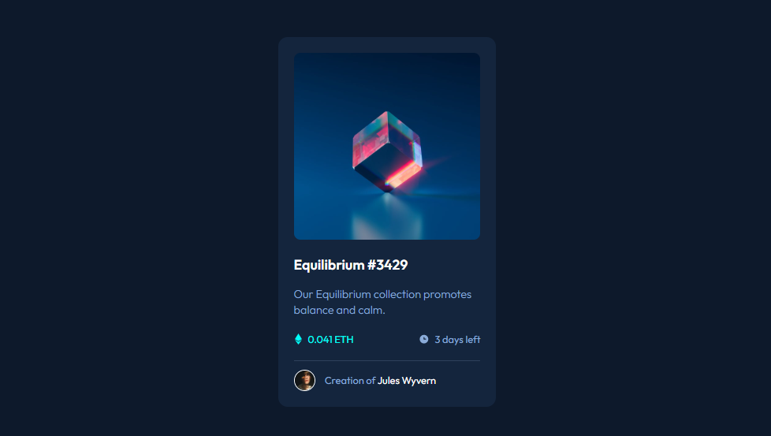

# NFT Card Preview - FrontEnd Mentor

Projeto de Cards NFT do site FrontEnd Mentor construído aplicando as técnicas de HTML e CSS avançados que eu aprendi no curso DevQuest. Nele foi aplicado os conceitos de CSS avançado, como flexbox.

[Clique aqui para acessar](https://edu-almeidaf.github.io/nft-card-preview/)

---

## Tecnologias Utilizadas:

- HTML
- CSS
- Git e Github

---

## Contato

[Linkedin](https://www.linkedin.com/in/almeidaedu/)